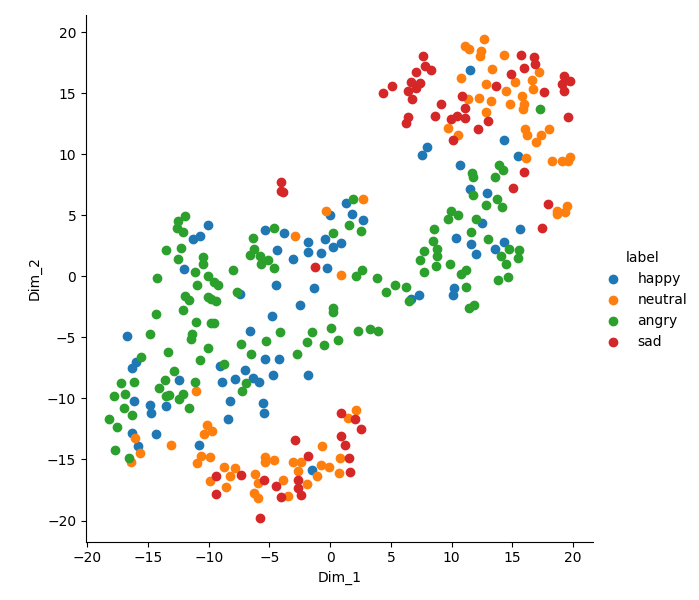
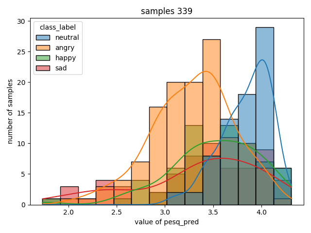
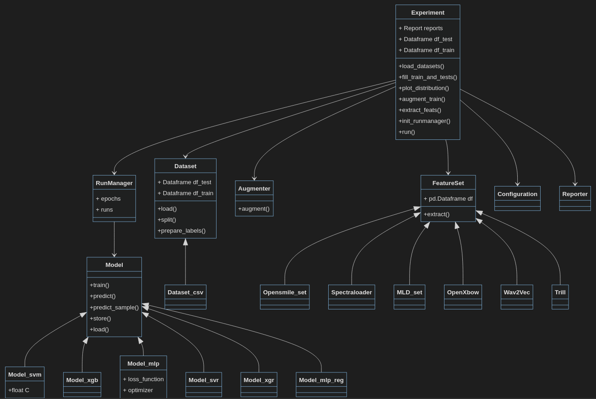

- [Overview](#overview)
  - [Confusion matrix](#confusion-matrix)
  - [Epoch progression](#epoch-progression)
  - [Feature importance](#feature-importance)
  - [Feature distribution](#feature-distribution)
  - [t-SNE plots](#t-sne-plots)
  - [Data distribution](#data-distribution)
  - [Bias checking](#bias-checking)
- [Documentation](#documentation)
- [Installation](#installation)
- [Usage](#usage)
  - [ini-file values](#ini-file-values)
  - [Hello World example](#hello-world-example)
  - [Features](#features)
- [License](#license)

 
## Overview
A project to detect speaker characteristics by machine learning experiments with a high-level interface.

The idea is to have a framework (based on e.g. sklearn and torch) that can be used to rapidly and automatically analyse audio data and explore machine learning models based on that data.

* NEW: Nkululeko now automatically generates PDF reports [sample for EmoDB](meta/images/emodb_report.pdf)
* The latest features can be seen in [the ini-file](./ini_file.md) options that are used to control Nkululeko
* Below is a [Hello World example](#helloworld) that should set you up fastly, also on [Google Colab](https://colab.research.google.com/drive/1GYNBd5cdZQ1QC3Jm58qoeMaJg3UuPhjw?usp=sharing#scrollTo=4G_SjuF9xeQf), and [with Kaggle](https://www.kaggle.com/felixburk/nkululeko-hello-world-example)
* [Here's a blog post on how to set up nkululeko on your computer.](http://blog.syntheticspeech.de/2021/08/30/how-to-set-up-your-first-nkululeko-project/)
* [Here is a slack channel to discuss issues related to nkululeko](https://join.slack.com/t/nkululekoworkspace/shared_invite/zt-1wtvbxtwz-P5YoRJq8whxKSee86ebhJg). Please click the link if interested in contributing.
* [Here's a slide presentation about nkululeko](docs/nkululeko.pdf)
* [Here's a video presentation about nkululeko](https://www.youtube.com/playlist?list=PLRceVavtxLg0y2jiLmpnUfiMtfvkK912D)
* [Here's the 2022 LREC article on nkululeko](http://felix.syntheticspeech.de/publications/Nkululeko_LREC.pdf)

Here are some examples of typical output:

### Confusion matrix
Per default, Nkululeko displays results as a confusion matrix using binning with regression.


### Epoch progression
The point when overfitting starts can sometimes be seen by looking at the results per epoch:


### Feature importance
Using the *explore* interface, Nkululeko analyses the importance of acoustic features:
 


### Feature distribution
And can show the distribution of specific features per category:


### t-SNE plots
A t-SNE plot can give you an estimate wether your acoustic features are useful at all:



### Data distribution
Sometimes you only want to take a look at your data:


### Bias checking
In cases you might wonder if there's bias in your data. You can try to detect this with automatically estimated speech properties, by visualizing the correlation of target label and predicted labels.



## Documentation
The documentation, along with extensions of installation, usage, INI file format, and examples, can be found [nkululeko.readthedocs.io](https://nkululeko.readthedocs.io).

## Installation

Create and activate a virtual Python environment and simply run
```
pip install nkululeko
```
We excluded some packages from the automatic installation because they might depend on your computer and some of them are only needed in special cases. So if the error
```
module x not found
```
appears, please try
```
pip install x
```
For many packages you will need the missing torch package.
If you don't have a GPU (which is probably true if you don't know what that is), please use
```
pip install torch torchvision torchaudio --index-url https://download.pytorch.org/whl/cpu
```
else, you can use the default:
```
pip install torch torchvision torchaudio
```

Some functionalities require extra packages to be installed, which we didn't include automatically:
* the SQUIM model needs a special torch version:
  ```
  pip uninstall -y torch torchvision torchaudio
  pip install --pre torch torchvision torchaudio --extra-index-url https://download.pytorch.org/whl/nightly/cpu
  ```
* the spotlight adapter needs spotlight:
  ```
  pip install renumics-spotlight sliceguard 
  ```


Some examples for *ini*-files (which you use to control nkululeko) are in the [tests folder](https://github.com/felixbur/nkululeko/tree/main/tests).


## Usage

### [ini-file values](./ini_file.md)

Nkululeko works by specifiying 


Basically, you specify your experiment in an ["ini" file](./ini_file.md) (e.g. *experiment.ini*) and then call one of the Nkululeko interfaces to run the experiment like this:
  * ```python -m nkululeko.nkululeko --config experiment.ini```

A basic configuration looks like this:
```
[EXP]
root = ./
name = exp_emodb
[DATA]
databases = ['emodb']
emodb = ./emodb/
emodb.split_strategy = speaker_split
target = emotion
labels = ['anger', 'boredom', 'disgust', 'fear']
[FEATS]
type = ['praat']
[MODEL]
type = svm
[EXPL]
model = tree
plot_tree = True
[PLOT]
combine_per_speaker = mode
```
Read the [Hello World example](#hello-world-example) for initial usage with Emo-DB dataset.

Here is an overview of the interfaces/modules:

All of them take *--config <my_config.ini>* as an argument.

* **nkululeko.nkululeko**: do machine learning experiments combining features and learners
* **nkululeko.multidb**: do [multiple experiments](http://blog.syntheticspeech.de/2024/01/02/nkululeko-compare-several-databases/), comparing several databases cross and in itself
* **nkululeko.demo**: [demo the current best model](http://blog.syntheticspeech.de/2022/09/01/nkululeko-how-to-evaluate-a-test-set-with-a-given-best-model/) on the command line
  * *--list* (optional) list of input files
  * *--file* (optional) name of input file
  * *--outfile* (optional) name of CSV file for output
* **nkululeko.test**: predict a [given data set](http://blog.syntheticspeech.de/2022/09/01/nkululeko-how-to-evaluate-a-test-set-with-a-given-best-model/) with the current best model
* **nkululeko.explore**: perform [data exploration](http://blog.syntheticspeech.de/2023/05/11/nkululeko-how-to-visualize-your-data-distribution/)
* **nkululeko.augment**: [augment](http://blog.syntheticspeech.de/2023/03/13/nkululeko-how-to-augment-the-training-set/) the current training data
* **nkululeko.aug_train**: augment the current training data [and do a training](http://blog.syntheticspeech.de/2023/03/13/nkululeko-how-to-augment-the-training-set/) including this data
* **nkululeko.predict**: [predict features](http://blog.syntheticspeech.de/2023/08/16/nkululeko-how-to-predict-labels-for-your-data-from-existing-models-and-check-them/) like SNR, MOS, arousal/valence, age/gender, with DNN models
* **nkululeko.segment**: [segment a database](http://blog.syntheticspeech.de/2023/07/14/nkululeko-segmenting-a-database/) based on VAD (voice activity detection)
* **nkululeko.resample**: check on all [sampling rates and change](http://blog.syntheticspeech.de/2023/08/31/how-to-fix-different-sampling-rates-in-a-dataset-with-nkululeko/) to 16kHz 

There's my [blog](http://blog.syntheticspeech.de/?s=nkululeko) with tutorials:
* [Introduction](http://blog.syntheticspeech.de/2021/08/04/machine-learning-experiment-framework/)
* [Nkulueko FAQ](http://blog.syntheticspeech.de/2022/07/07/nkululeko-faq/)
* [How to set up your first nkululeko project](http://blog.syntheticspeech.de/2021/08/30/how-to-set-up-your-first-nkululeko-project/)
* [Setting up a base nkululeko experiment](http://blog.syntheticspeech.de/2021/10/05/setting-up-a-base-nkululeko-experiment/)
* [How to import a database](http://blog.syntheticspeech.de/2022/01/27/nkululeko-how-to-import-a-database/) 
* [Comparing classifiers and features](http://blog.syntheticspeech.de/2021/10/05/nkululeko-comparing-classifiers-and-features/)
* [Use Praat features](http://blog.syntheticspeech.de/2022/06/27/how-to-use-selected-features-from-praat-with-nkululeko/)
* [Combine feature sets](http://blog.syntheticspeech.de/2022/06/30/how-to-combine-feature-sets-with-nkululeko/)
* [Classifying continuous variables](http://blog.syntheticspeech.de/2022/01/26/nkululeko-classifying-continuous-variables/) 
* [Try out / demo a trained model](http://blog.syntheticspeech.de/2022/01/24/nkululeko-try-out-demo-a-trained-model/) 
* [Perform cross database experiments](http://blog.syntheticspeech.de/2021/10/05/nkululeko-perform-cross-database-experiments/)
* [Meta parameter optimization](http://blog.syntheticspeech.de/2021/09/03/perform-optimization-with-nkululeko/)
* [How to set up wav2vec embedding](http://blog.syntheticspeech.de/2021/12/03/how-to-set-up-wav2vec-embedding-for-nkululeko/)
* [How to soft-label a database](http://blog.syntheticspeech.de/2022/01/24/how-to-soft-label-a-database-with-nkululeko/) 
* [Re-generate the progressing confusion matrix animation wit a different framerate](demos/plot_faster_anim.py)
* [How to limit/filter a dataset](http://blog.syntheticspeech.de/2022/02/22/how-to-limit-a-dataset-with-nkululeko/)
* [Specifying database disk location](http://blog.syntheticspeech.de/2022/02/21/specifying-database-disk-location-with-nkululeko/) 
* [Add dropout with MLP models](http://blog.syntheticspeech.de/2022/02/25/adding-dropout-to-mlp-models-with-nkululeko/)
* [Do cross-validation](http://blog.syntheticspeech.de/2022/03/23/how-to-do-cross-validation-with-nkululeko/)
* [Combine predictions per speaker](http://blog.syntheticspeech.de/2022/03/24/how-to-combine-predictions-per-speaker-with-nkululeko/)
* [Run multiple experiments in one go](http://blog.syntheticspeech.de/2022/03/28/how-to-run-multiple-experiments-in-one-go-with-nkululeko/)
* [Compare several MLP layer layouts with each other](http://blog.syntheticspeech.de/2022/04/11/how-to-compare-several-mlp-layer-layouts-with-each-other/)
* [Import features from outside the software](http://blog.syntheticspeech.de/2022/10/18/how-to-import-features-from-outside-the-nkululeko-software/)
* [Explore feature importance](http://blog.syntheticspeech.de/2023/02/20/nkululeko-show-feature-importance/)
* [Plot distributions for feature values](http://blog.syntheticspeech.de/2023/02/16/nkululeko-how-to-plot-distributions-of-feature-values/)
* [Show feature importance](http://blog.syntheticspeech.de/2023/02/20/nkululeko-show-feature-importance/)
* [Augment the training set](http://blog.syntheticspeech.de/2023/03/13/nkululeko-how-to-augment-the-training-set/)
* [Visualize clusters of acoustic features](http://blog.syntheticspeech.de/2023/04/20/nkululeko-visualize-clusters-of-your-acoustic-features/)
* [Visualize your data distribution](http://blog.syntheticspeech.de/2023/05/11/nkululeko-how-to-visualize-your-data-distribution/)
* [Check your dataset](http://blog.syntheticspeech.de/2023/07/11/nkululeko-check-your-dataset/) 
* [Segmenting a database](http://blog.syntheticspeech.de/2023/07/14/nkululeko-segmenting-a-database/)
* [Predict new labels for your data from public models and check bias](http://blog.syntheticspeech.de/2023/08/16/nkululeko-how-to-predict-labels-for-your-data-from-existing-models-and-check-them/)
* [Resample](http://blog.syntheticspeech.de/2023/08/31/how-to-fix-different-sampling-rates-in-a-dataset-with-nkululeko/)
* [Get some statistics on correlation and effect-size](http://blog.syntheticspeech.de/2023/09/05/nkululeko-get-some-statistics-on-correlation-and-effect-size/)
* [Generate a latex / pdf report](http://blog.syntheticspeech.de/2023/09/26/nkululeko-generate-a-latex-pdf-report/) 
* [Inspect your data with Spotlight](http://blog.syntheticspeech.de/2023/10/31/nkululeko-inspect-your-data-with-spotlight/)
* [Automatically stratify your split sets](http://blog.syntheticspeech.de/2023/11/07/nkululeko-automatically-stratify-your-split-sets/)
* [re-name data column names](http://blog.syntheticspeech.de/2023/11/16/nkululeko-re-name-data-column-names/)
* [Oversample the training set](http://blog.syntheticspeech.de/2023/11/16/nkululeko-oversample-the-training-set/)  
* [Compare several databases](http://blog.syntheticspeech.de/2024/01/02/nkululeko-compare-several-databases/)

### <a name="helloworld">Hello World example</a>
* NEW: [Here's a Google colab that runs this example out-of-the-box](https://colab.research.google.com/drive/1GYNBd5cdZQ1QC3Jm58qoeMaJg3UuPhjw?usp=sharing#scrollTo=4G_SjuF9xeQf), and here is the same [with Kaggle](https://www.kaggle.com/felixburk/nkululeko-hello-world-example)
* [I made a video to show you how to do this on Windows](https://www.youtube.com/playlist?list=PLRceVavtxLg0y2jiLmpnUfiMtfvkK912D)
* Set up Python on your computer, version >= 3.8
* Open a terminal/commandline/console window
* Test python by typing ```python```, python should start with version >3 (NOT 2!). You can leave the Python Interpreter by typing *exit()*
* Create a folder on your computer for this example, let's call it `nkulu_work`
* Get a copy of the [Berlin emodb in audformat](https://zenodo.org/records/7447302/files/emodb.zip?download=1) and unpack inside the folder you just created (`nkulu_work`)
* Make sure the folder is called "emodb" and does contain the database files directly (not box-in-a-box)
* Also, in the `nkulu_work` folder: 
  * Create a Python environment
    * ```python -m venv venv```
  * Then, activate it:
    * under Linux / mac
      * ```source venv/bin/activate```
    * under Windows
      * ```venv\Scripts\activate.bat```
    * if that worked, you should see a ```(venv)``` in front of your prompt
  * Install the required packages in your environment
    * ```pip install nkululeko```
    * Repeat until all error messages vanished (or fix them, or try to ignore them)...
* Now you should have two folders in your *nkulu_work* folder:
  * *emodb* and *venv*
* Download a copy of the file [exp_emodb.ini](meta/demos/exp_emodb.ini) to the current working directory (```nkulu_work```)
* Run the demo
  * ```python -m nkululeko.nkululeko --config exp_emodb.ini```
* Find the results in the newly created folder exp_emodb 
  * Inspect ```exp_emodb/images/run_0/emodb_xgb_os_0_000_cnf.png```
  * This is the main result of you experiment: a confusion matrix for the emodb emotional categories
* Inspect and play around with the [demo configuration file](meta/demos/exp_emodb.ini) that defined your experiment, then re-run.
* There are many ways to experiment with different classifiers and acoustic features sets, [all described here](https://github.com/felixbur/nkululeko/blob/main/ini_file.md)
  
### Features
The framework is targeted at the speech domain and supports experiments where different classifiers are combined with different feature extractors.

* Classifiers: Naive Bayes, KNN, Tree, XGBoost, SVM, MLP
* Feature extractors: Praat, Opensmile, openXBOW BoAW, TRILL embeddings, Wav2vec2 embeddings, audModel embeddings, ...
* Feature scaling
* Label encoding
* Binning (continuous to categorical)
* Online demo interface for trained models 

Here's a rough UML-like sketch of the framework (and [here's the real one done with pyreverse](meta/images/classes.png)).


Currently, the following linear classifiers are implemented (integrated from sklearn):
* SVM, SVR, XGB, XGR, Tree, Tree_regressor, KNN, KNN_regressor, NaiveBayes, GMM
  and the following ANNs (artificial neural networks)
* MLP (multi-layer perceptron), CNN (convolutional neural network)

Here's [an animation that shows the progress of classification done with nkululeko](https://youtu.be/6Y0M382GjvM)


## License
Nkululeko can be used under the [MIT license](https://choosealicense.com/licenses/mit/)
If you use it, please mention the Nkululeko paper

F. Burkhardt, Johannes Wagner, Hagen Wierstorf, Florian Eyben and Björn Schuller: Nkululeko: A Tool For Rapid Speaker Characteristics Detection, Proc. Proc. LREC, 2022


```
@inproceedings{Burkhardt:lrec2022,
   title = {Nkululeko: A Tool For Rapid Speaker Characteristics Detection},
   author = {Felix Burkhardt and Johannes Wagner and Hagen Wierstorf and Florian Eyben and Björn Schuller},
   isbn = {9791095546726},
   journal = {2022 Language Resources and Evaluation Conference, LREC 2022},
   keywords = {machine learning,speaker characteristics,tools},
   pages = {1925-1932},
   publisher = {European Language Resources Association (ELRA)},
   year = {2022},
}
```
