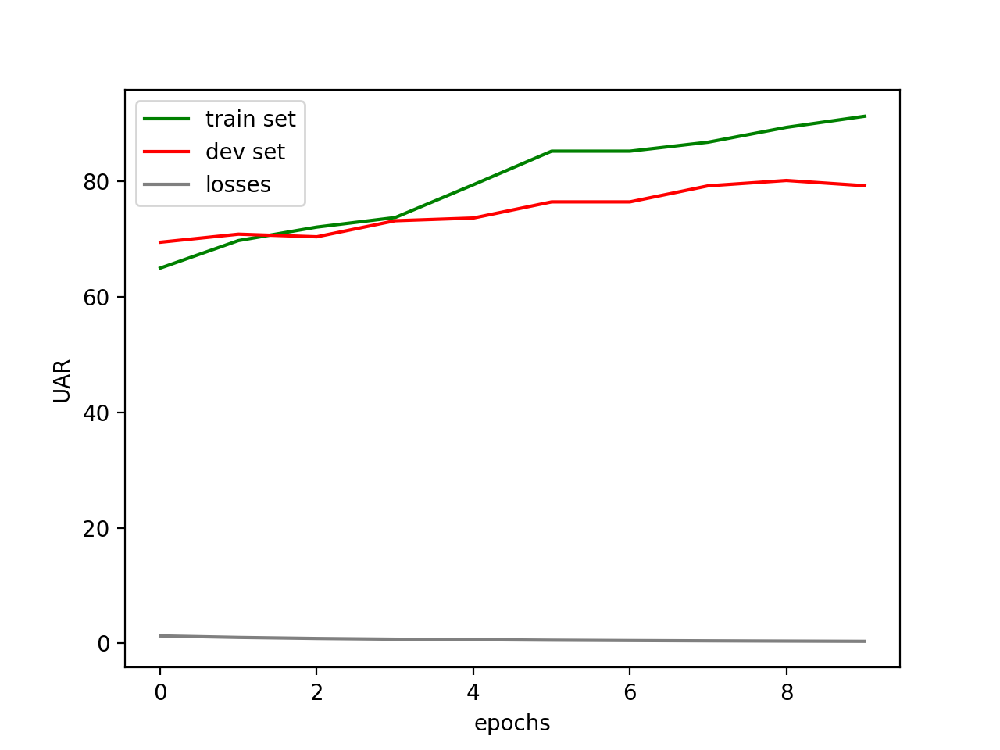
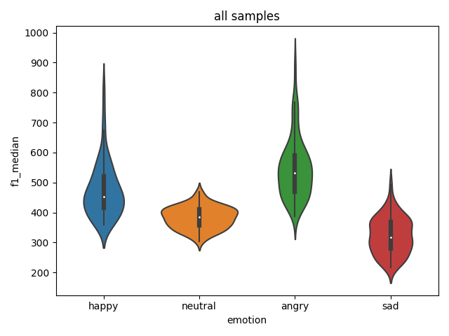
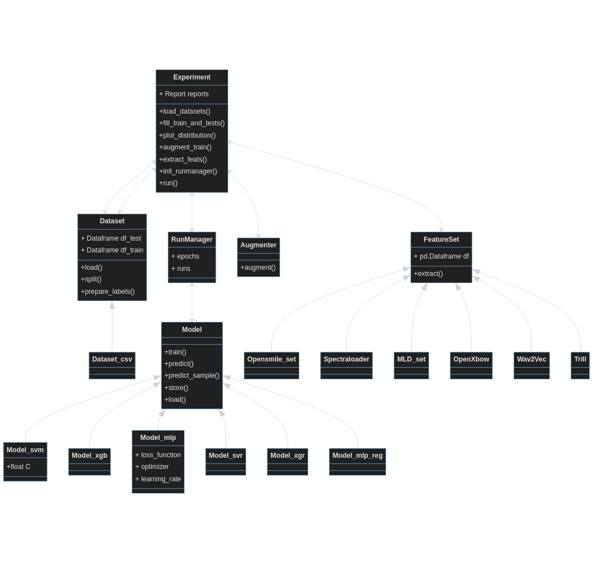

# Nkululeko
* [Overview](#overview)
* [Installation](#installation)
* [Usage](#usage)
* [Hello World](#hello-world-example)
* [Licence](#licence)

## Overview
A project to detect speaker characteristics by machine learning experiments with a high-level interface.

The idea is to have a framework (based on e.g. sklearn and torch) that can be used by people not being experienced programmers as they mainly have to adapt an initialization parameter file per experiment.

* The latest features can be seen in [the ini-file](./ini_file.md) options](./ini_file.md) that are used to control Nkululeko
* Below is a [Hello World example](#helloworld) that should set you up fastly.
* [Here's a blog post on how to set up nkululeko on your computer.](http://blog.syntheticspeech.de/2021/08/30/how-to-set-up-your-first-nkululeko-project/)
* [Here's a slide presentation about nkululeko](docs/nkululeko.pdf)
* [Here's a video presentation about nkululeko](https://www.youtube.com/playlist?list=PLRceVavtxLg0y2jiLmpnUfiMtfvkK912D)
* [Here's the 2022 LREC article on nkululeko](http://felix.syntheticspeech.de/publications/Nkululeko_LREC.pdf)

Here are some examples of typical output:

### Confusion matrix
Per default, Nkululeko displays results as a confusion matrix using binning with regression.


### Epoch progression
The point when overfitting starts can sometimes be seen by looking at the results per epoch:



### Feature importance
Using the *explore* interface, Nkululeko analyses the importance of acoustic features:
 


### Feature distribution
And can show the distribution of specific features per category:



### t-SNE plots
A t-SNE plot can give you an estimate wether your acoustic features are useful at all:


### Data distribution
Sometimes you only want to take a look at your data:


## Installation

Create and activate a virtual Python environment and simply run
```
pip install nkululeko
```

Some examples for *ini*-files (which you use to control nkululeko) are in the [tests folder](https://github.com/felixbur/nkululeko/tree/main/tests).


## Usage
Basically, you specify your experiment in an "ini" file (e.g. *experiment.ini*) and then call one of the Nkululeko interfaces to run the experiment like this:
  * ```python -m nkululeko.nkululeko --config experiment.ini```

A basic configuration looks like this:
```
[EXP]
root = ./
name = exp_emodb
[DATA]
databases = ['emodb']
emodb = ./emodb/
emodb.split_strategy = speaker_split
target = emotion
labels = ['anger', 'boredom', 'disgust', 'fear']
[FEATS]
type = ['praat']
[MODEL]
type = svm
[EXPL]
model = tree
plot_tree = True
[PLOT]
combine_per_speaker = mode
```
Read the [Hello World example](#hello-world-example) for initial usage with Emo-DB dataset.

Here is an overview of the interfaces:
* **nkululeko.nkululeko**: doing experiments
* **nkululeko.demo**: demo the current best model on command line
* **nkululeko.test**: predict a series of files with the current best model
* **nkululeko.explore**: perform data exploration
* **nkululeko.augment**: augment the current training data

Alternatively, there is a central "experiment" class that can be used by own experiments

There's my [blog](http://blog.syntheticspeech.de/?s=nkululeko) with tutorials:
* [Introduction](http://blog.syntheticspeech.de/2021/08/04/machine-learning-experiment-framework/)
* [Nkulueko FAQ](http://blog.syntheticspeech.de/2022/07/07/nkululeko-faq/)
* [How to set up your first nkululeko project](http://blog.syntheticspeech.de/2021/08/30/how-to-set-up-your-first-nkululeko-project/)
* [Setting up a base nkululeko experiment](http://blog.syntheticspeech.de/2021/10/05/setting-up-a-base-nkululeko-experiment/)
* [How to import a database](http://blog.syntheticspeech.de/2022/01/27/nkululeko-how-to-import-a-database/) 
* [Comparing classifiers and features](http://blog.syntheticspeech.de/2021/10/05/nkululeko-comparing-classifiers-and-features/)
* [Use Praat features](http://blog.syntheticspeech.de/2022/06/27/how-to-use-selected-features-from-praat-with-nkululeko/)
* [Combine feature sets](http://blog.syntheticspeech.de/2022/06/30/how-to-combine-feature-sets-with-nkululeko/)
* [Classifying continuous variables](http://blog.syntheticspeech.de/2022/01/26/nkululeko-classifying-continuous-variables/) 
* [Try out / demo a trained model](http://blog.syntheticspeech.de/2022/01/24/nkululeko-try-out-demo-a-trained-model/) 
* [Plot distributions of feature values](http://blog.syntheticspeech.de/2023/02/16/nkululeko-how-to-plot-distributions-of-feature-values/)
* [Perform cross database experiments](http://blog.syntheticspeech.de/2021/10/05/nkululeko-perform-cross-database-experiments/)
* [Meta parameter optimization](http://blog.syntheticspeech.de/2021/09/03/perform-optimization-with-nkululeko/)
* [How to set up wav2vec embedding](http://blog.syntheticspeech.de/2021/12/03/how-to-set-up-wav2vec-embedding-for-nkululeko/)
* [How to soft-label a database](http://blog.syntheticspeech.de/2022/01/24/how-to-soft-label-a-database-with-nkululeko/) 
* [Re-generate the progressing confusion matrix animation wit a different framerate](demos/plot_faster_anim.py)
* [How to limit/filter a dataset](http://blog.syntheticspeech.de/2022/02/22/how-to-limit-a-dataset-with-nkululeko/)
* [Specifying database disk location](http://blog.syntheticspeech.de/2022/02/21/specifying-database-disk-location-with-nkululeko/) 
* [Add dropout with MLP models](http://blog.syntheticspeech.de/2022/02/25/adding-dropout-to-mlp-models-with-nkululeko/)
* [Do cross-validation](http://blog.syntheticspeech.de/2022/03/23/how-to-do-cross-validation-with-nkululeko/)
* [Combine predictions per speaker](http://blog.syntheticspeech.de/2022/03/24/how-to-combine-predictions-per-speaker-with-nkululeko/)
* [Run multiple experiments in one go](http://blog.syntheticspeech.de/2022/03/28/how-to-run-multiple-experiments-in-one-go-with-nkululeko/)
* [Compare several MLP layer layouts with each other](http://blog.syntheticspeech.de/2022/04/11/how-to-compare-several-mlp-layer-layouts-with-each-other/)
* [Import features from outside the software](http://blog.syntheticspeech.de/2022/10/18/how-to-import-features-from-outside-the-nkululeko-software/)
* [Explore feature importance](http://blog.syntheticspeech.de/2023/02/20/nkululeko-show-feature-importance/)
* [Plot distributions for feature values](http://blog.syntheticspeech.de/2023/02/16/nkululeko-how-to-plot-distributions-of-feature-values/)
* [Show feature importance](http://blog.syntheticspeech.de/2023/02/20/nkululeko-show-feature-importance/)
* [Augment the training set](http://blog.syntheticspeech.de/2023/03/13/nkululeko-how-to-augment-the-training-set/)
 * [Visualize clusters of acoustic features](http://blog.syntheticspeech.de/2023/04/20/nkululeko-visualize-clusters-of-your-acoustic-features/)

The framework is targeted at the speech domain and supports experiments where different classifiers are combined with different feature extractors.

Here's a rough UML-like sketch of the framework.


Currently, the following linear classifiers are implemented (integrated from sklearn):
* SVM, SVR, XGB, XGR, Tree, Tree_regressor, KNN, KNN_regressor, NaiveBayes, GMM
  and the following ANNs
* MLP, CNN (tbd)

Here's [an animation that shows the progress of classification done with nkululeko](https://youtu.be/6Y0M382GjvM)

### Initialization file
You could 
* use a generic main python file (like my_experiment.py), 
* adapt the path to your nkululeko src 
* and then adapt an .ini file (again fitting at least the paths to src and data)
  
Here's [an overview of the ini-file options](./ini_file.md)

### <a name="helloworld">Hello World example</a>
* NEW: [I made a video to show you how to do this on Windows](https://www.youtube.com/playlist?list=PLRceVavtxLg0y2jiLmpnUfiMtfvkK912D)
* Set up Python on your computer, version >= 3.6
* Open a terminal/commandline/console window
* Test python by typing ```python```, python should start with version >3 (NOT 2!). You can leave the Python Interpreter by typing *exit()*
* Create a folder on your computer for this example, let's call it `nkulu_work`
* Get a copy of the [Berlin emodb in audformat](https://tubcloud.tu-berlin.de/s/LfkysdXJfiobiEG) and unpack the same folder (`nkulu_work`)
* Make sure the folder is called "emodb" and does contain the database files directly (not box-in-a-box)
* Also, in the `nkulu_work` folder: 
  * Create a Python environment
    * ```python -m venv venv```
  * Then, activate it:
    * under Linux / mac
      * ```source venv/bin/activate```
    * under Windows
      * ```venv\Scripts\activate.bat```
    * if that worked, you should see a ```(venv)``` in front of your prompt
  * Install the required packages in your environment
    * ```pip install nkululeko```
    * Repeat until all error messages vanished (or fix them, or try to ignore them)...
* Now you should have two folders in your *nkulu_work* folder:
  * *emodb* and *venv*
* Download a copy of the file [exp_emodb.ini](demos/exp_emodb.ini) to the current working directory (```nkulu_work```)
* Run the demo
  * ```python -m nkululeko.nkululeko --config exp_emodb.ini```
* Find the results in the newly created folder exp_emodb 
  * Inspect ```exp_emodb/images/run_0/emodb_xgb_os_0_000_cnf.png```
  * This is the main result of you experiment: a confusion matrix for the emodb emotional categories
* Inspect and play around with the [demo configuration file](demos/exp_emodb.ini) that defined your experiment, then re-run.
* There are many ways to experiment with different classifiers and acoustic features sets, [all described here](https://github.com/felixbur/nkululeko/blob/main/ini_file.md)
  
### Features
* Classifiers: Naive Bayes, KNN, Tree, XGBoost, SVM, MLP
* Feature extractors: Praat, Opensmile, openXBOW BoAW, TRILL embeddings, Wav2vec2 embeddings, audModel embeddings, ...
* Feature scaling
* Label encoding
* Binning (continuous to categorical)
* Online demo interface for trained models 

### Outlook
* Classifiers: CNN
* Feature extractors: mid-level descriptors, Mel-spectra

## License
Nkululeko can be used under the [MIT license](https://choosealicense.com/licenses/mit/)
