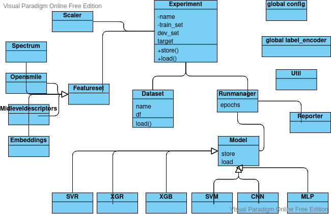

# Nkululeko
A project to detect speaker characteristics by machine learning experiments with a high level interface based on [audformat](https://github.com/audeering/audformat).

## Overview
The idea is to have a very high level framework (based on e.g. sklearn and pytorch) that can be used by people not being experienced programmers as they mainly have to adapt the initialization parameter files.
[Here's a blog post on how to set up nkululeko on your computer.](http://blog.syntheticspeech.de/2021/08/30/how-to-set-up-your-first-nkululeko-project/)

There is a central "experiment" class that can be used by own experiments, two examples are given with
* [experiment.py](experiment.py) ([configuration](exp_emodb.ini)), using SVM classifier
* [configuration](exp_emodb_mlp.ini), using MLP classifier

The framework is targeted at the speech domain and supports experiments where different classifiers are combined with different feature extractors.

Here's a rough UML-like sketch of the framework.

Currently the following linear classifiers are implemented (integrated from sklearn):
* SVM, SVR, XGB, XGR
  and the following ANNs
* MLP, CNN (tbd)

Here's [an animation that shows the progress of classification done with nkululeko](https://youtu.be/6Y0M382GjvM)

## Usage
You could 
* use a generic main python file (like exp_emodb.py), 
* adapt the path to your nkululeko src 
* and then adapt an .ini file (again adapting at least the paths to src and data)
  
Here's [an overview on the ini-file options](./ini_file.md)

## Features
* Classifiers: XGB, XGR, SVM, SVR, MLP
* Feature extractors: opensmile, TRILL embeddings (experimental)
* Feature scaling
* Label encoding
* Binning (continuous to categorical)

## Outlook
* Classifiers: CNN
* Feature extractors: mid level descriptors, Mel-spectra, embeddings
* Online demo interface for trained models 
