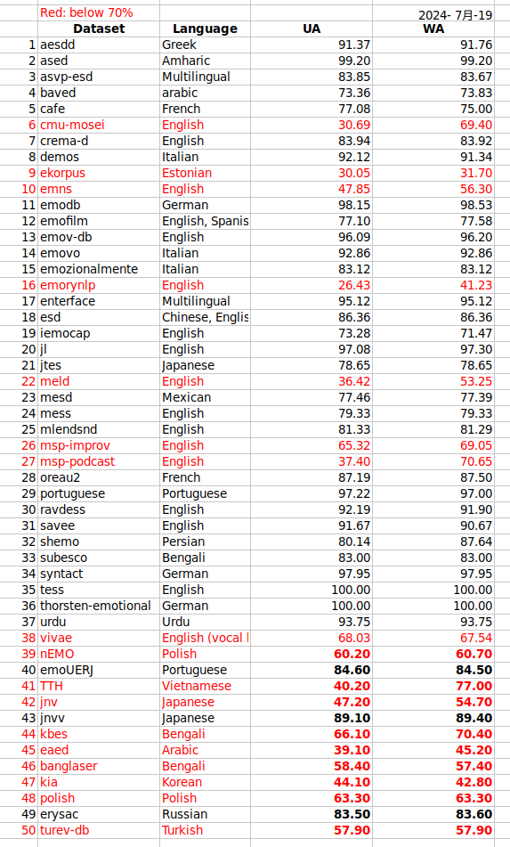

Nkululeko Data Directory
========================

# README Creation

This is the default top directory for Nkululeko data import. Each database should be in its own subfolder (you can also use `ln -sf` to soft link original database path to these subfolders) and contain a README how to import the data to Nkululeko CSV or audformat.This README file is automatically generated by `data/make_readme.py` script (needs `mdutils` package). To update this file, run the script again after adding new datasets and adding the necessary information to the `descr.yml` file. 
## Accessibility

The column `access` in the table below indicates the database's accessability. The following values are used:
- `public`: the database is publicly available in the internet and can be downloaded directly without any restrictions.
- `restricted`: the database is publicly available on the internet but requires registration or other restrictions to download.
- `private`: the database is not publicly available on the internet and requires the private information of the owner of the dataset.

To support open science and reproducible research, we encourage to submit PR and recipes for public dataset for now on.
|Name|Target|Description|Access|License|
| :--- | :--- | :--- | :--- | :--- |
|emorynlp|emotion|English Emotion Dataset from Friends TV Show|public|unknown|
|emns|emotion,intensity|British, singles speaker, UAR=.479|public|CC BY 4.0|
|test|none|Test data for nkululeko|public|unknown|
|clac|healthyspeech,age,gender|English|public|Custom academic/research use|
|vivae|emotion|English vocal bursts|public|unknown|
|emofilm|emotion|English, Spanish, Italian|restricted|unknown|
|emozionalmente|emotion|Italian|public|unknown|
|laughter-types|laughter|Master Thesis from TUBerlin|public|unknown|
|savee|emotion|English, from tfds|restricted|Custom academic/research use|
|emovo|emotion|Italian|restricted|CC BY-NC-SA 4.0|
|subesco|emotion|Bangla|public|Custom academic/research use|
|oreau2|emotion|French|public|unknown|
|mess|emotion|English|public|unknown|
|emov-db|emotion|English|public|CC BY 4.0|
|odyssey-cat-2024|emotion|Data for Odyssey 2024 challenge, needs MSPPodcast|restricted|unknown|
|ravdess|emotion,speaker|English|public|CC BY 4.0|
|erysac|emotion|Russian, children|public|unknown|
|demos|emotion|Italian|restricted|Custom academic/research use|
|emodb|emotion|German|public|CC BY 4.0|
|jnv|emotion|Japanese, non-verbals|public|unknown|
|aesdd|emotion|amharic language|public|unknown|
|msp-podcast|emotion,VAD|English|restricted|unknown|
|baved|emotion|Arabic|public|CC BY 4.0|
|asvp-esd|emotion|Multilingual, also contain vocal bursts|public|Custom academic/research use|
|ekorpus|emotion|Estonian|public|unknown|
|iemocap|emotion,VAD|English|restricted|Custom academic/research use|
|jl|emotion|English|public|ODC-By|
|syntact|emotion|Synthesized German speech|public|Custom academic/research use|
|kia|emotion|Korean, wake-up word|public|unknown|
|portuguese|emotion|Portuguese|public|Custom academic/research use|
|crema-d|emotion|English,adopted from tfds|public|Custom academic/research use|
|thorsten-emotional|emotion|German|public|CC BY 4.0|
|jvnv|emotion|Japanese, verbal and non-verbal|public|unknown|
|mesd|emotion|Mexican|public|unknown|
|enterface|emotion|Multilingual|public|unknown|
|turev|emotion|Turkish|public|unknown|
|nEMO|emotion,VAD|Polish|public|unknown|
|eaed|emotion|Arabic|public|unknown|
|ased|emotion|Greek|public|unknown|
|cafe|emotion|Childrenspeech, CanadianFrench|public|Custom academic/research use|
|banglaser|emotion|Bengali|public|unknown|
|mlendsnd|emotion|English|public|Custom academic/research use|
|gerparas|valence,arousal,dominance|German|restricted|unknown|
|androids|depression|English|public|unknown|
|kbes|emotion|Bengali|public|unknown|
|tess|emotion|British English (Toronto)|public|Custom academic/research use|
|jtes|emotion|Japanese|private|unknown|
|meld|emotion|English, From Friends TV|public|CC BY 4.0|
|urdu|emotion|Urdu|public|unknown|
|polish|emotion|Polish|public|unknown|
|cmu-mosei|sentiment,emotion|English, original link dead|public|unknown|
|svd|pahtological speech|German speech data for detecting various pathological voices|public|unknown|
|msp-improv|emotion,VAD,naturalness|English|restricted|unknown|
|shemo|emotion|Persian|public|Custom academic/research use|
|esd|emotion|English,Chinese|public|unknown|
|dementianet|audio for dementia screening|hundred of public figure audio samples with a confirmed dementia diagnosis|public|MIT|

This recipe contains information about 56 datasets.
## Performance
  
  
