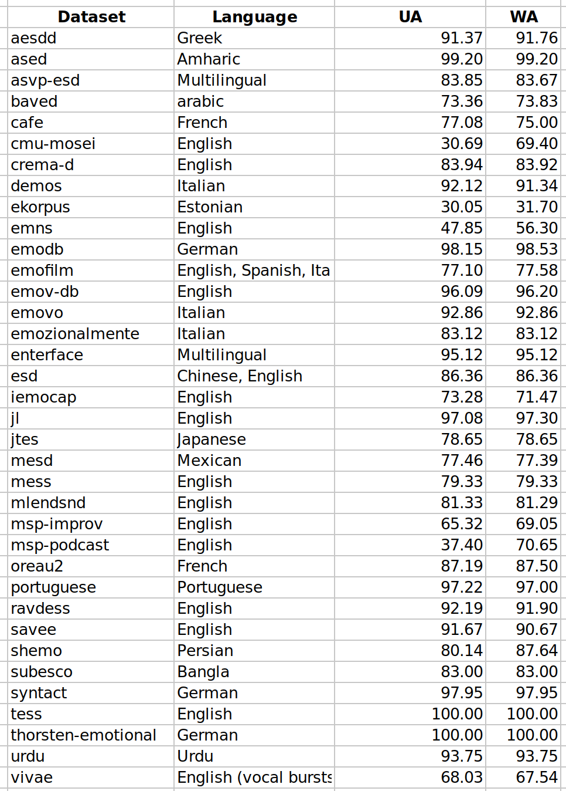

# Data

This is the default top directory for data import for Nkululeko.

Each database should be in its own subfolder (you can also use `ln -sf`` to soft link original database path to these subfolders) and contain a README how to import the data to Nkululeko CSV or audformat.

## Accesibility

The column `acess` in the table below indicates the accessability of the database. The following values are used:
- `public`: the database is publicly available in the internet and can be downloaded directly without any restrictions.
- `restricted`: the database is publicly available in the internet but requires registration or other restrictions to download.
- `private`: the database is not publicly available in the internet and requires to contact privately to the owner of the dataset.

## Databases

| # |name | target | acess | descr. |
| --|---- | ------ | ----- | -------|
| 1 | aesdd | emotion | public | amharic language |
| 2 | androids | depression | public | English |
| 3 | ased | emotion | public | Greek |
| 4 | asvp-esd | emotion | public | Multilingual, also contain vocal bursts |
| 5 | baved | emotion | public | Arabic |
| 6 | cafe | emotion | public | Children speech, Canadian French|
| 7 | cmu-mosei | sentiment, emotion| public | English, original link dead|
| 8 | crema-d | emotion | public | English, adopted from tfds|
| 9 | demos | emotion | restricted | Italian |
|10 | ekorpus | emotion | public | Estonian |
|11 | emns | emotion, intensity | public | British, single speaker, UAR=0.479 |
|12 | emodb | emotion | public | German |
|13 | emofilm | emotion | restricted | English, Spanish, Italian |
|14 | emorynlp | emotion | public | English, From Friends TV |   
|15 | emov-db | emotion | public | English|
|16 | emovo | emotion | restricted | Italian |
|17 | emozionalmente | emotion | public | Italian |
|18 | enterface | emotion | public | Multilingual|
|19 | esd | emotion| public | English, Chinese|
|20 | iemocap | emotion, VAD | restriced | English |
|21 | jl | emotion | public | English|
|22 | jtes | emotion | private | Japanese |
|23 | laughter-types | laughter | public | Master Thesis from TU Berlin|
|24 | meld | emotion | public | English, From Friends TV|
|25 | mesd | emotion | public | Mexican |
|26 | mess | emotion | public | English |
|27 | mlendsnd | emotion | public | English |
|28 | msp-improv | emotion, VAD, naturalness | restricted | English |
|29 | msp-podcast | emotion, VAD | restricted | English |
|30 | oreau2 | emotion | public | French |
|31 | portuguese | emotion | public |  Portuguese |
|32 | ravdess | emotion, speaker | public | English |
|33 | savee | emotion | restricted | English, from tfds |
|34 | shemo | emotion | public | Persian |
|35 | subesco | emotion | public | Bangla |
|36 | syntact | emotion | public | Synthesized German speech |
|37 | tess | emotion | public | British English (Toronto) |
|38 | thorsten-emotional | emotion | public | German |
|29 | urdu | emotion | public | Urdu |
|40 | vivae | emotion | public | English vocal bursts|
|41 | clac | healthy speech, age, gender | public | English |
|42 | gerparas | valence, arousal, dominance | restricted | German |

# Performance 
<!-- include performance from images directory -->
