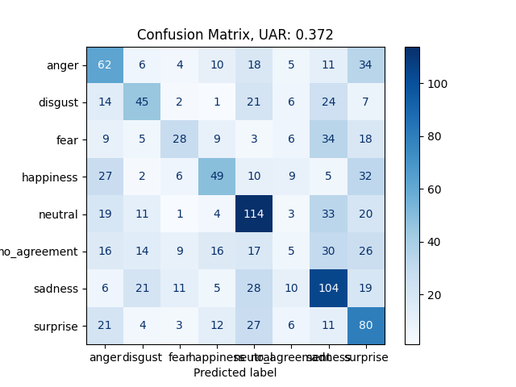

This folder is to import the 
Emozionalmente: a crowdsourced Italian speech emotional corpus
database to nkululeko.

I used the version downloadable from [zenodo](https://zenodo.org/record/6569824)

downloaded June 20th 2023

Download and unzip

```bash
wget https://zenodo.org/record/6569824/files/emozionalmente_dataset.zip
unzip emozionalmente_dataset.zip
```

Then, create the database by running
```
python create.py
```

Change to parent directory and run (to enable experiments without installing Nkululeko)  
```bash
cd ../..
```

then, you could run
```
python3 -m nkululeko.nkululeko --config data/emozionalmente/nkulu_os_xgb.ini
```
to test and
```
python3 -m nkululeko.explore --config nkulu_os_xgb.ini
```
to see the data distribution (plot distribution of gender)

Should result into a confusion matrix like this

