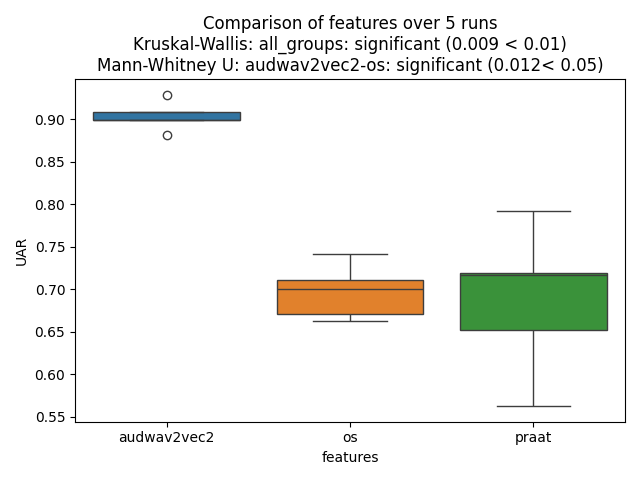
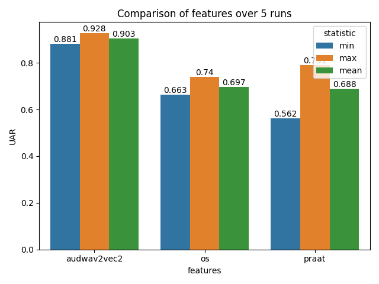

# Comparing Classifiers, Features, and Databases

This tutorial explains how to use Nkululeko's multiple runs feature to statistically compare different experimental configurations. This is essential for determining if differences between feature sets, classifiers, or databases are statistically significant.

## Overview

Since Nkululeko version 0.98, you can run experiments multiple times and compare outcomes across different configurations with statistical significance testing.

**Use cases:**
- Compare feature extractors (OpenSMILE vs. Praat vs. wav2vec2)
- Compare classifiers (SVM vs. XGBoost vs. MLP)
- Compare databases or training data combinations

## Key Configuration Options

### Multiple Runs

Set the number of experimental runs in `[EXP]`:

```ini
[EXP]
runs = 10
epochs = 100
```

Each run uses a different random seed, producing a distribution of results.

### Statistical Output

Enable detailed statistics in `[EXPL]`:

```ini
[EXPL]
print_stats = True
```

### Comparison Plot

Configure what to compare in `[PLOT]`:

```ini
[PLOT]
runs_compare = features  # Options: 'features', 'models', 'databases'
```

## Example: Comparing Feature Extractors

This example compares OpenSMILE, Praat, and audmodel features for emotion recognition.

### Step 1: Create Base Configuration

All configurations share the same experiment name but differ in feature type.

#### Configuration 1: OpenSMILE (`exp_emodb_compare_os.ini`)

```ini
[EXP]
root = ./examples/results/
name = exp_emodb_compare
runs = 5
epochs = 50
save = True

[DATA]
databases = ['emodb']
emodb = ./data/emodb/emodb
emodb.split_strategy = speaker_split
labels = ['anger', 'happiness', 'neutral', 'sadness']
target = emotion

[FEATS]
type = ['os']
scale = standard

[MODEL]
type = mlp
layers = {'l1':64, 'l2':16}
patience = 5

[EXPL]
print_stats = True

[PLOT]
runs_compare = features
best_model = True
```

#### Configuration 2: Praat (`exp_emodb_compare_praat.ini`)

```ini
[FEATS]
type = ['praat']
scale = standard
```

(Other sections remain the same)

#### Configuration 3: audmodel (`exp_emodb_compare_audmodel.ini`)

```ini
[FEATS]
type = ['audwav2vec2']
scale = standard
```

(Other sections remain the same)

### Step 2: Run All Configurations

```bash
# Run with OpenSMILE features
python -m nkululeko.nkululeko --config examples/exp_emodb_compare_os.ini

# Run with Praat features
python -m nkululeko.nkululeko --config examples/exp_emodb_compare_praat.ini

# Run with audmodel features
python -m nkululeko.nkululeko --config examples/exp_emodb_compare_audmodel.ini
```

### Step 3: View Comparison Results

After running all configurations, Nkululeko generates:
- A comparison plot showing distributions for each feature type
- Statistical significance tests (Mann-Whitney U or t-test)
- Overall and pairwise significance values

The plot shows:
- Box plots or violin plots of accuracy distributions
- Title with overall significance (e.g., p < 0.05)
- Pairwise comparisons between configurations

### Example Output Plots

**Box Plot Comparison:**



**Bar Plot Comparison:**



## Statistical Tests

Nkululeko automatically selects the appropriate test:

| Number of Runs | Test Used |
|----------------|-----------|
| ≤ 30 | Mann-Whitney U test (non-parametric) |
| > 30 | Student's t-test (parametric) |

## Comparing Different Aspects

### Compare Classifiers

```ini
[PLOT]
runs_compare = models
```

Then run experiments with different `[MODEL] type` values:
- `type = svm`
- `type = xgb`
- `type = mlp`

### Compare Databases

```ini
[PLOT]
runs_compare = databases
```

Then run experiments with different database configurations.

## Best Practices

### Number of Runs

| Purpose | Recommended Runs |
|---------|------------------|
| Quick comparison | 5-10 |
| Publication | 10-30 |
| High confidence | 30+ |

More runs = more statistical power, but longer runtime.

### Keep Other Variables Constant

When comparing one aspect, keep everything else the same:
- **Comparing features**: Same model, same data, same splits
- **Comparing models**: Same features, same data, same splits
- **Comparing databases**: Same features, same model

### Use Same Experiment Name

All configurations being compared should use the same `name` in `[EXP]`:

```ini
[EXP]
name = exp_emodb_compare  # Same for all configurations
```

This ensures results are collected in the same folder for comparison.

## Output Files

After running multiple configurations:

```
results/exp_emodb_compare/
├── images/
│   └── runs_comparison.png      # Comparison plot with statistics
├── results/
│   ├── run_results_os.txt       # Results for OpenSMILE
│   ├── run_results_praat.txt    # Results for Praat
│   └── run_results_audmodel.txt # Results for audmodel
└── ...
```

## Interpreting Results

### Significance Levels

| p-value | Interpretation |
|---------|----------------|
| p < 0.001 | Highly significant (***) |
| p < 0.01 | Very significant (**) |
| p < 0.05 | Significant (*) |
| p ≥ 0.05 | Not significant (ns) |

### Example Output

The comparison plot title might show:
```
Overall: p=0.003** | Largest pairwise: os vs audmodel p=0.001***
```

This means:
- Overall difference across all groups is significant (p=0.003)
- The largest difference is between OpenSMILE and audmodel features

## Complete Workflow Example

```bash
# 1. Compare features
python -m nkululeko.nkululeko --config examples/exp_emodb_compare_os.ini
python -m nkululeko.nkululeko --config examples/exp_emodb_compare_praat.ini
python -m nkululeko.nkululeko --config examples/exp_emodb_compare_audmodel.ini

# 2. Check the comparison plot
# Open: examples/results/exp_emodb_compare/images/runs_comparison.png
```

## Tips

1. **Start with fewer runs** (5) for quick exploration, increase for final results
2. **Use speaker-independent splits** (`speaker_split`) for realistic evaluation
3. **Document your configurations** for reproducibility
4. **Consider computational cost**: More runs × more epochs = longer runtime
5. **Check for convergence**: Ensure models have enough epochs to converge

## Limitations

- Statistical comparison assumes runs are independent samples
- Some statisticians debate whether multiple random seeds truly represent independent samples
- Consider this approach as exploratory rather than definitive proof

## Related Tutorials

- [Using Uncertainty](uncertainty.md)
- [Hyperparameter Optimization](optim.md)
- [Multi-Database Experiments](multidb.md)

## Reference

- [Blog: How to compare classifiers, features and databases](http://blog.syntheticspeech.de/2025/09/24/nkululeko-how-to-compare-classifiers-features-and-databases-using-multiple-runs/)
