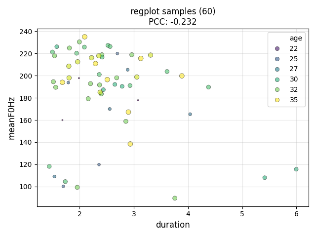
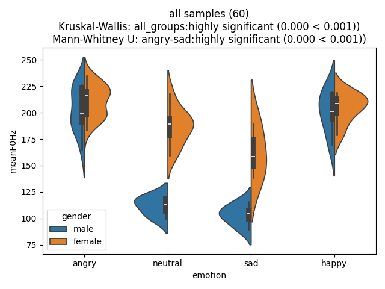
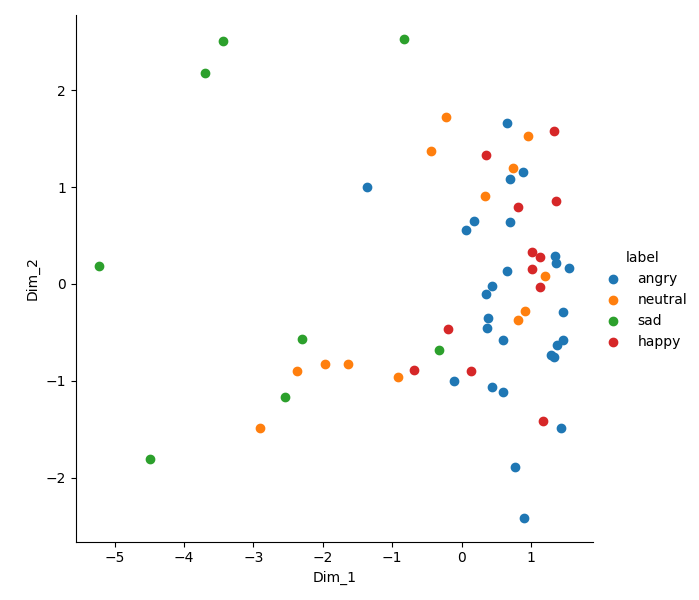

# Investigating Feature Correlations

This tutorial explains how to use Nkululeko to investigate correlations between acoustic features and target variables. This is useful for understanding which features are related to each other and how they relate to your classification or regression target.

## Overview

Nkululeko provides the `regplot` feature in the `[EXPL]` section to visualize correlations between:
- Two acoustic features with a categorical target (classification)
- Two acoustic features with a continuous target (regression)

This helps you:
- Understand feature relationships
- Identify redundant features
- Discover feature-target correlations
- Gain insights for feature engineering

## Configuration

The `regplot` option accepts a list of feature pairs (and optionally a target):

```ini
[EXPL]
regplot = [['feature1', 'feature2'], ['feature1', 'feature2', 'target']]
```

### Syntax

| Format | Description |
|--------|-------------|
| `['feat1', 'feat2']` | Plot feat1 vs feat2, colored by default target |
| `['feat1', 'feat2', 'target']` | Plot feat1 vs feat2, colored by specified target |

## Example Configuration

### File: `exp_emodb_explore_features.ini`

```ini
[EXP]
root = ./examples/results/
name = exp_emodb_explore
runs = 1
epochs = 1
save = True

[DATA]
databases = ['emodb']
emodb = ./data/emodb/emodb
emodb.split_strategy = random
labels = ['angry', 'happy', 'neutral', 'sad']
emodb.mapping = {'anger':'angry', 'happiness':'happy', 'sadness':'sad', 'neutral':'neutral'}
target = emotion

[FEATS]
type = ['praat']
features = ['duration', 'meanF0Hz', 'stdevF0Hz', 'HNR', 'localJitter']

[MODEL]
type = xgb

[EXPL]
sample_selection = all
feature_distributions = all
model = ['tree', 'xgb']
max_feats = 5
# Regplot: investigate feature correlations
regplot = [['duration', 'meanF0Hz'], ['duration', 'meanF0Hz', 'age']]
scatter = ['pca']
print_stats = True
```

### Run the Experiment

```bash
python -m nkululeko.explore --config examples/exp_emodb_explore_features.ini
```

## Understanding Regplot Output

### Categorical Target (Classification)

When the target is categorical (e.g., emotion), the plot shows:
- X-axis: First feature (e.g., `duration`)
- Y-axis: Second feature (e.g., `meanF0Hz`)
- Colors: Different target classes (e.g., angry, happy, neutral, sad)
- Regression lines: Per-class trend lines

Example configuration:
```ini
regplot = [['duration', 'meanF0Hz']]
```

This produces a scatter plot where each emotion class is shown in a different color, helping you see if the features separate the classes.


### Continuous Target (Regression)

When the target is continuous (e.g., age), the plot shows:
- X-axis: First feature
- Y-axis: Second feature
- Colors: Binned target values (grouped into ranges)
- Regression lines: Per-group trend lines

Example configuration:
```ini
regplot = [['duration', 'meanF0Hz', 'age']]
```

This produces a scatter plot where age is grouped into bins and each bin is shown in a different color.



## Advanced Usage

### Multiple Regplots

You can specify multiple feature pairs:

```ini
[EXPL]
regplot = [['lld_mfcc3_sma3_median', 'lld_mfcc1_sma3_median'],
           ['lld_mfcc3_sma3_median', 'lld_F2frequency_sma3nz_median', 'age'],
           ['meanF0Hz', 'stdevF0Hz'],
           ['HNR', 'localJitter', 'gender']]
```

Each pair generates a separate plot in the `images` folder.

### Using OpenSMILE Features

For more detailed acoustic analysis, use OpenSMILE features:

```ini
[FEATS]
type = ['os']
set = eGeMAPSv02

[EXPL]
regplot = [['F0semitoneFrom27.5Hz_sma3nz_amean', 'jitterLocal_sma3nz_amean'],
           ['shimmerLocaldB_sma3nz_amean', 'HNRdBACF_sma3nz_amean']]
```

### Combining with Other Exploration Options

Regplot works well with other `[EXPL]` options:

```ini
[EXPL]
# Feature distributions per class
feature_distributions = all

# Dimensionality reduction scatter plots
scatter = ['pca', 'tsne']

# Feature correlation plots
regplot = [['duration', 'meanF0Hz']]

# Feature importance analysis
model = ['tree', 'xgb']
max_feats = 10

# Print statistics
print_stats = True
```

### Feature Distribution Plot

The `feature_distributions = all` option generates per-class distribution plots for each feature:



### PCA Scatter Plot

The `scatter = ['pca']` option generates dimensionality reduction visualizations:



## Output Files

After running, you'll find plots in:

```
results/exp_emodb_explore/images/
├── regplot_duration-meanF0Hz-emotion.png
├── regplot_duration-meanF0Hz-age.png
└── ...
```

The filename format is: `regplot_{feature1}-{feature2}-{target}.png`

## Use Cases

1. **Feature Selection**: Identify which features correlate with the target
2. **Redundancy Detection**: Find highly correlated features that could be removed
3. **Class Separability**: Visualize how well features separate classes
4. **Data Quality**: Spot outliers or data issues
5. **Research Insights**: Understand acoustic correlates of speaker characteristics

## Tips

1. **Start with meaningful features**: Choose features you expect to be related
2. **Use domain knowledge**: Acoustic features like F0 and intensity often correlate with emotion
3. **Check multiple targets**: Compare emotion, gender, age to understand different patterns
4. **Combine with feature importance**: Use regplot to validate feature importance findings
5. **Export for publications**: The generated plots are suitable for papers and presentations

## Related Features

- **Feature Distributions** (`feature_distributions`): Per-class density plots
- **Scatter Plots** (`scatter`): PCA/t-SNE/UMAP dimensionality reduction
- **Feature Importance** (`model`): Tree-based feature ranking

## Related Tutorials

- [Regplot Documentation](regplot.md)
- [Explore Module](explore.md)
- [Visualization Guide](visualization.md)

## References

- [Blog: How to investigate correlations of specific features](http://blog.syntheticspeech.de/2025/12/02/nkululeko-how-to-investigate-correlations-of-specific-features/)
- [Blog: How to plot distributions of feature values](https://blog.syntheticspeech.de/2023/02/16/nkululeko-how-to-plot-distributions-of-feature-values/)
