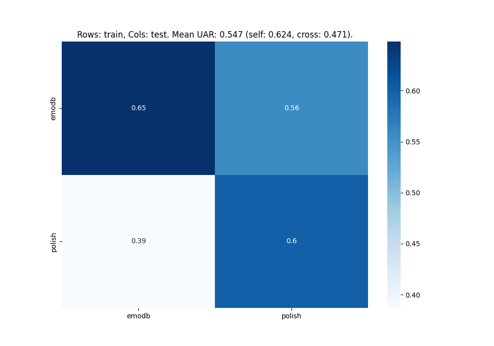

# Multidb module for database comparison

With nkululeko since version 0.77.7 there is a new interface named multidb, which lets you compare several databases.

You can state their names in the [EXP] section and they will then be processed one after each other and against each other; the results are stored in a file called heatmap.png in the experiment folder.

<!-- >> YOU NEED TO OMIT THE PROJECT NAME! -->

Here is an example of such an INI file

```ini
[EXP]
root = ./experiments/emodbs/
#  You don't need to give it a name, 
# this will be the combination 
# of the two databases: 
# traindb_vs_testdb
epochs = 1
databases = ['emodb', 'polish']
[DATA]
root_folders = ./experiments/emodbs/data_roots.ini
target = emotion
labels = ['neutral', 'happy', 'sad', 'angry']
[FEATS]
type = ['os']
[MODEL]
type = xgb
```
You can (but don't have to) state the specific dataset values in an external file like above.

```ini
[DATA]
emodb = ./data/emodb/emodb
emodb.split_strategy = specified
emodb.test_tables = ['emotion.categories.test.gold_standard']
emodb.train_tables = ['emotion.categories.train.gold_standard']
emodb.mapping = {'anger':'angry', 'happiness':'happy', 'sadness':'sad', 'neutral':'neutral'}
polish = ./data/polish_emo
polish.mapping = {'anger':'angry', 'joy':'happy', 'sadness':'sad', 'neutral':'neutral'}
polish.split_strategy = speaker_split
polish.test_size = 30
```

Finally, you can run the experiment with the following command:

```bash
python -m nkululeko.multidb --config my_conf.ini
```

Here's a result with two databases.



Another example for combining dementianet and dementiabank:

```ini
[EXP]
root = ./results
name = exp_multidb_dementia
save = True

[DATA]
databases = ['dementianet_train', 'dementianet_val', 'dementianet_test', 'dementiabank_train', 'dementiabank_val', 'dementiabank_test']
; DementiaNet dataset
dementianet_train = ./data/dementianet/dementianet_train.csv
dementianet_train.type = csv
dementianet_train.absolute_path = False
dementianet_train.mapping = {'nodementia': 'control', 'dementia': 'dementia'}
dementianet_train.split_strategy = train
dementianet_val = ./data/dementianet/dementianet_val.csv
dementianet_val.type = csv
dementianet_val.absolute_path = False
dementianet_val.mapping = {'nodementia': 'control', 'dementia': 'dementia'}
dementianet_val.split_strategy = train
dementianet_test = ./data/dementianet/dementianet_test.csv
dementianet_test.type = csv
dementianet_test.absolute_path = False
dementianet_test.mapping = {'nodementia': 'control', 'dementia': 'dementia'}
dementianet_test.split_strategy = test
; DementiaBank dataset
dementiabank_train = ./data/dementiabank/dementiabank_train.csv
dementiabank_train.type = csv
dementiabank_train.absolute_path = False
dementiabank_train.mapping = {'control': 'control', 'dementia': 'dementia'}
dementiabank_train.split_strategy = train
dementiabank_val = ./data/dementiabank/dementiabank_val.csv
dementiabank_val.type = csv
dementiabank_val.absolute_path = False
dementiabank_val.mapping = {'control': 'control', 'dementia': 'dementia'}
dementiabank_val.split_strategy = train
dementiabank_test = ./data/dementiabank/dementiabank_test.csv
dementiabank_test.type = csv
dementiabank_test.absolute_path = False
dementiabank_test.mapping = {'control': 'control', 'dementia': 'dementia'}
dementiabank_test.split_strategy = test
target = dementia

[FEATS]
type = ['praat']
scale = speaker
balancing = ros

[EXPL]
feature_distributions = True
model = ['xgb']
permutation = True
max_feats = 15
sample_selection = all
shap = True
scatter = ['umap', 'pca']

[MODEL]
type = xgb
save = True
n_estimators = 100
max_depth = 6
learning_rate = 0.3
subsample = 1.0
n_jobs = 10

[RESAMPLE]
replace = True

[PLOT]
format = pdf
```

Source: http://blog.syntheticspeech.de/2024/01/02/nkululeko-compare-several-databases/