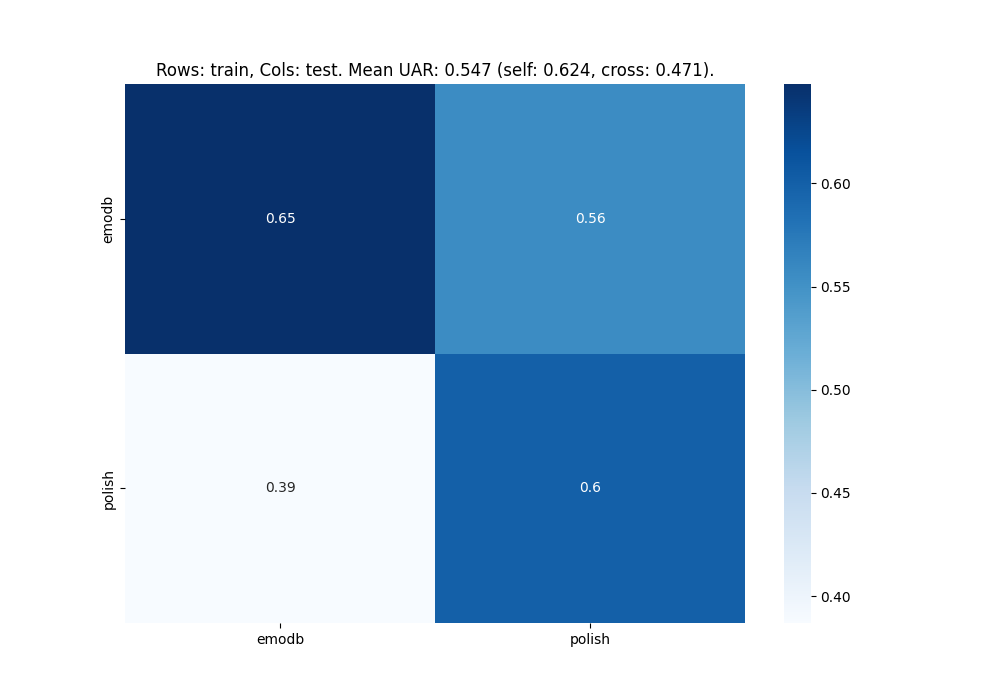

# nkululeko.multidb

Multidb module for database comparison

With nkululeko since version 0.77.7 there is a new interface named multidb, which lets you compare several databases.

You can state their names in the [EXP] section and they will then be processed one after each other and against each other; the results are stored in a file called heatmap.png in the experiment folder.

The heatmap includes an extra "mean (cross)" row and column: the mean performance across the *other* databases, excluding each database's own self-train/self-test (diagonal) result. If every single result in the run comes back as exactly 0.0 (usually caused by an empty train/test split for every database pair, or a saved model being reused against an unlabeled test set), no heatmap is written at all -- an error message is printed instead, since an all-zero matrix isn't a meaningful result to plot.

If an individual database pair fails (e.g. a split leaving train/test label sets that don't overlap), that pair is logged and left blank in the heatmap rather than aborting the whole run -- every other pair still gets computed and plotted.

Each database's acoustic features (extracted once per database, before any train/test split) are shared across every pair it appears in, in a `_feat_cache` folder under `[EXP] root`, instead of being re-extracted once per pair -- set `DATA.no_reuse` or `FEATS.no_reuse` to disable this and always extract fresh.

<!-- >> YOU NEED TO OMIT THE PROJECT NAME! -->

Here is an example of such an INI file

```ini
[EXP]
root = ./experiments/emodbs/
#  You don't need to give it a name, 
# this will be the combination 
# of the two databases: 
# traindb_vs_testdb
epochs = 1
databases = ['emodb', 'polish']
[DATA]
root_folders = ./experiments/emodbs/data_roots.ini
target = emotion
labels = ['neutral', 'happy', 'sad', 'angry']
[FEATS]
type = ['os']
[MODEL]
type = xgb
```
You can (but don't have to) state the specific dataset values in an external file like above.

```ini
[DATA]
emodb = ./data/emodb/emodb
emodb.split_strategy = specified
emodb.test_tables = ['emotion.categories.test.gold_standard']
emodb.train_tables = ['emotion.categories.train.gold_standard']
emodb.mapping = {'anger':'angry', 'happiness':'happy', 'sadness':'sad', 'neutral':'neutral'}
polish = ./data/polish_emo
polish.mapping = {'anger':'angry', 'joy':'happy', 'sadness':'sad', 'neutral':'neutral'}
polish.split_strategy = speaker_split
polish.test_size = 30
```

Finally, you can run the experiment with the following command:

```bash
python -m nkululeko.multidb --config my_conf.ini
```

or, equivalently, with the config file as a plain positional argument:

```bash
python -m nkululeko.multidb my_conf.ini
```

Here's a result with two databases.



Another example for combining dementianet and dementiabank:

```ini
[EXP]
root = ./results
name = exp_multidb_dementia
save = True

[DATA]
databases = ['dementianet_train', 'dementianet_val', 'dementianet_test', 'dementiabank_train', 'dementiabank_val', 'dementiabank_test']
; DementiaNet dataset
dementianet_train = ./data/dementianet/dementianet_train.csv
dementianet_train.type = csv
dementianet_train.absolute_path = False
dementianet_train.mapping = {'nodementia': 'control', 'dementia': 'dementia'}
dementianet_train.split_strategy = train
dementianet_val = ./data/dementianet/dementianet_val.csv
dementianet_val.type = csv
dementianet_val.absolute_path = False
dementianet_val.mapping = {'nodementia': 'control', 'dementia': 'dementia'}
dementianet_val.split_strategy = train
dementianet_test = ./data/dementianet/dementianet_test.csv
dementianet_test.type = csv
dementianet_test.absolute_path = False
dementianet_test.mapping = {'nodementia': 'control', 'dementia': 'dementia'}
dementianet_test.split_strategy = test
; DementiaBank dataset
dementiabank_train = ./data/dementiabank/dementiabank_train.csv
dementiabank_train.type = csv
dementiabank_train.absolute_path = False
dementiabank_train.mapping = {'control': 'control', 'dementia': 'dementia'}
dementiabank_train.split_strategy = train
dementiabank_val = ./data/dementiabank/dementiabank_val.csv
dementiabank_val.type = csv
dementiabank_val.absolute_path = False
dementiabank_val.mapping = {'control': 'control', 'dementia': 'dementia'}
dementiabank_val.split_strategy = train
dementiabank_test = ./data/dementiabank/dementiabank_test.csv
dementiabank_test.type = csv
dementiabank_test.absolute_path = False
dementiabank_test.mapping = {'control': 'control', 'dementia': 'dementia'}
dementiabank_test.split_strategy = test
target = dementia

[FEATS]
type = ['praat']
scale = speaker
balancing = ros

[EXPL]
feature_distributions = True
model = ['xgb']
permutation = True
max_feats = 15
sample_selection = all
shap = True
scatter = ['umap', 'pca']

[MODEL]
type = xgb
save = True
n_estimators = 100
max_depth = 6
learning_rate = 0.3
subsample = 1.0
n_jobs = 10

[RESAMPLE]
replace = True

[PLOT]
format = pdf
```

Source: http://blog.syntheticspeech.de/2024/01/02/nkululeko-compare-several-databases/

## Leave-one-dataset-out (LODO) mode

Set `EXP.lodo = True` to switch multidb from the default N x N pairwise matrix to leave-one-dataset-out (LODO) cross-validation: for each database in `databases`, that database is held out as the fold's test set while every other database in the list is pooled together for training, rotating until every database has been the held-out test set exactly once. This is useful for estimating how well a model generalizes to an unseen recording domain, rather than to a single other database.

`databases` needs at least 2 entries, and `lodo` is not compatible with `reuse_train`, `train_extra`, or `use_splits`.

Instead of `heatmap.png`, LODO mode writes:

* `results_lodo.txt`: the overall LODO mean +/- std across fold means, plus each fold's own mean +/- std (and, if `lodo_runs > 1`, its individual per-run results).
* `lodo.png`: a bar chart of each fold's mean result with error bars.

Two optional settings refine the fold loop:

* **lodo_dev**: name of a database to exclude from the rotation and use as a fixed, genuine dev split (`split_strategy = dev`) in every fold, for real early-stopping instead of scoring epochs against the fold's own test set. Forces `traindevtest = True`. Must not also appear in `databases`.
* **lodo_runs**: repeats each fold that many times (forcing `EXP.runs = 1` per repeat) and reports each fold's mean +/- std across those repeats. Prefer this over `EXP.runs` for honest multi-seed averaging in LODO mode: with `EXP.runs > 1`, nkululeko returns only the single best-of-N-runs result per fold, not their mean. If `MODEL.random_seed` is set, every repeat would otherwise be identical, so `lodo_runs` is silently forced back down to 1 (with a warning).

```ini
[EXP]
root = ./experiments/lodo_demo/
databases = ['emodb', 'polish', 'emovo']
lodo = True
lodo_dev = for2sec
lodo_runs = 5
[DATA]
target = emotion
labels = ['neutral', 'happy', 'sad', 'angry']
[FEATS]
type = ['os']
[MODEL]
type = xgb
```

```bash
python -m nkululeko.multidb --config my_lodo_conf.ini
```