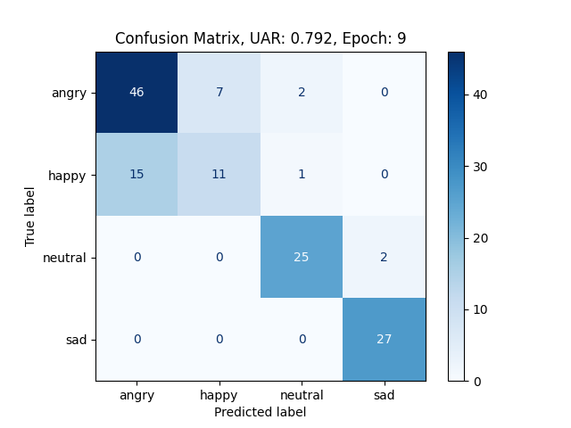
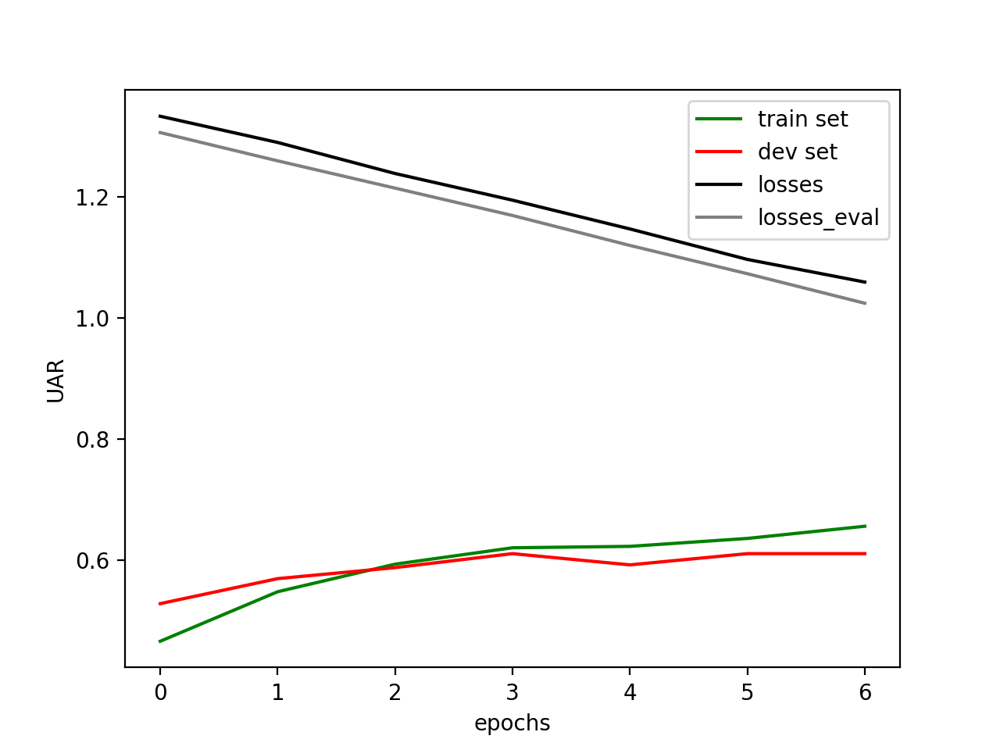
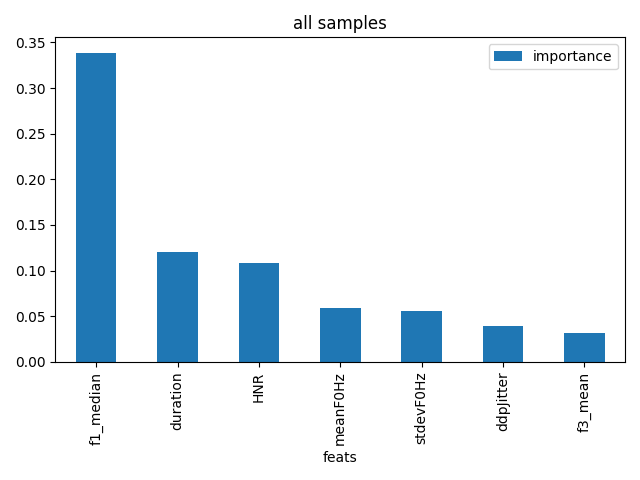
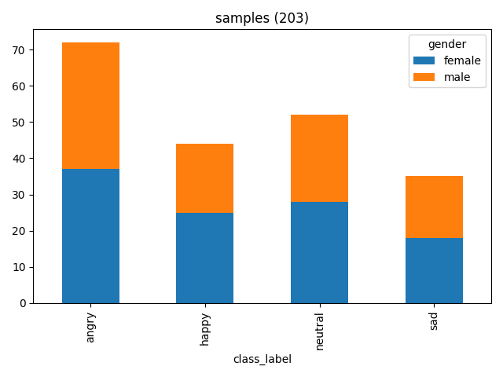
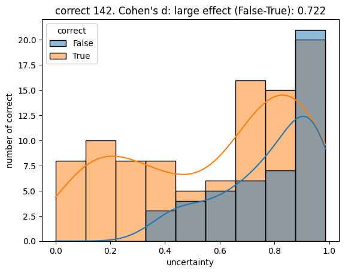

### Confusion matrix
Per default, Nkululeko displays results as a confusion matrix using binning with regression.

### Epoch progression
The point when overfitting starts can sometimes be seen by looking at the results per epoch:

### Feature importance
Using the *explore* interface, Nkululeko analyses the importance of acoustic features:
 

### Feature distribution
And can show the distribution of specific features per category:

If there are only two categories, a Mann-Whitney U test for significance is given:

### t-SNE plots
A t-SNE plot can give you an estimate of whether your acoustic features are useful at all:

### Data distribution
Sometimes, you only want to take a look at your data:

### Bias checking
In some cases, you might wonder if there's bias in your data. You can try to detect this with automatically estimated speech properties by visualizing the correlation of target labels and predicted labels.

### Uncertainty
Nkululeko estimates the uncertainty of model decisions (only for classifiers) with entropy over the class probabilities or logits per sample.

