# PVQD Dysphonia — Praat+OS Exploration Report (Grade)

**Config:** `experiments/pvqd-dysphonia/explore_praat_sus.ini`  
**Features:** Praat (sustained utterance) + OpenSMILE (eGeMAPS), combined (10 plotted features)  
**Models (permutation importance):** XGBoost + SVM + Logistic Regression (averaged)  
**Target:** grade (GRBAS overall dysphonia severity: normal / mild / moderate / severe)  
**Statistical tests:** Kruskal-Wallis overall; pairwise Mann-Whitney U; threshold p < 0.1  
**Note:** Only the `grade` target has been run so far. Results for roughness, breathiness, asthenia, and strain are pending.

---

## Class Distribution

357 samples. Normal and mild dominate; moderate and severe are small groups.

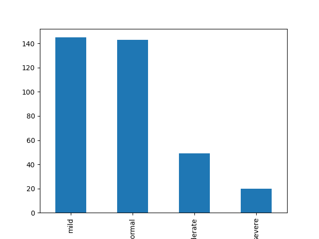

| Grade | n |
|-------|---|
| mild | ~145 |
| normal | ~143 |
| moderate | ~50 |
| severe | ~20 |

---

## Feature Importance Overview

Top-10 features by averaged permutation importance (XGBoost + SVM + LogReg).

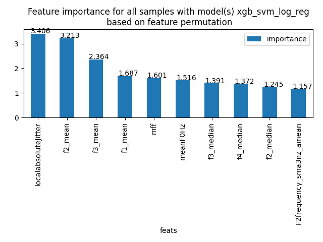

| Rank | Feature | Importance |
|------|---------|-----------|
| 1 | `localabsoluteJitter` | 3.406 |
| 2 | `f2_mean` | 3.213 |
| 3 | `f3_mean` | 2.364 |
| 4 | `f1_mean` | 1.687 |
| 5 | `mff` | 1.601 |
| 6 | `meanF0Hz` | 1.516 |
| 7 | `f3_median` | 1.391 |
| 8 | `f4_median` | 1.372 |
| 9 | `f2_median` | 1.245 |
| 10 | `F2frequency_sma3nz_amean` | 1.157 |

Jitter and F2 dominate. The top-10 are almost exclusively Praat features, with `F2frequency_sma3nz_amean` (eGeMAPS) appearing only at rank 10 — consistent with the feature set being Praat-heavy.

---

## Demographic Distributions

### Age distribution — highly significant (KW p < 0.001)

Age is a strong confound: normal and mild speakers are substantially younger (peak ~20 years), while moderate and severe speakers skew older (peak ~60–70 years). The largest effect is normal–severe (Cohen's d = 1.642).

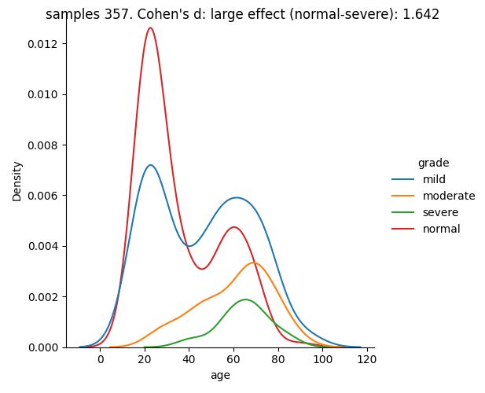

Pairwise age comparisons:

| Pair | p-value | Significance |
|------|---------|-------------|
| mild–moderate | 0.004 | significant |
| mild–normal | 0.005 | significant |
| mild–severe | < 0.001 | highly significant |
| moderate–normal | < 0.001 | highly significant |
| moderate–severe | 0.264 | not significant |
| normal–severe | < 0.001 | highly significant |

Acoustic differences between grade categories should be interpreted with awareness that age contributes to both vocal and articulatory changes. Moderate and severe speakers are substantially older than normal/mild speakers.

### Gender distribution — not significant (chi2 p = 0.892)

Gender proportions are consistent across grade categories (roughly 70 % female, 30 % male throughout). No gender confound is present.

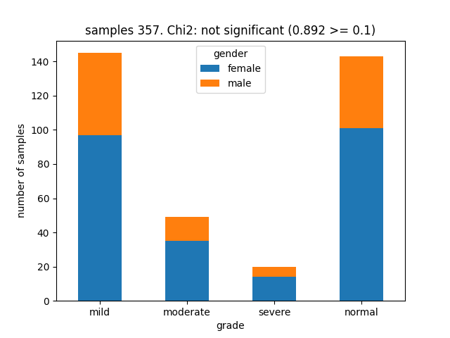

---

## Statistical Feature Distributions

---

### Highly significant features (p < 0.001)

#### `localabsoluteJitter` — KW p < 0.001

*Praat absolute jitter: mean absolute cycle-to-cycle period difference in seconds. A direct measure of vocal fold aperiodicity.*

Jitter is the strongest acoustic discriminator by permutation importance (3.406). The overall distribution is highly right-skewed for all grades; violin plots show the bulk of values clustering near zero, but moderate speakers (particularly males) exhibit a long upper tail reaching 10× the normal-grade values. The bar plot is critical here for interpreting the group means because the violins largely overlap near zero.

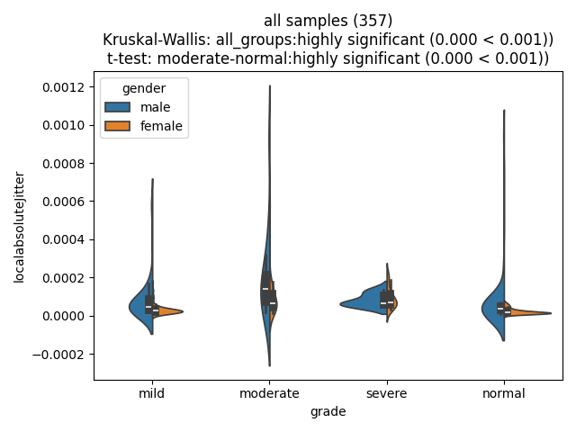

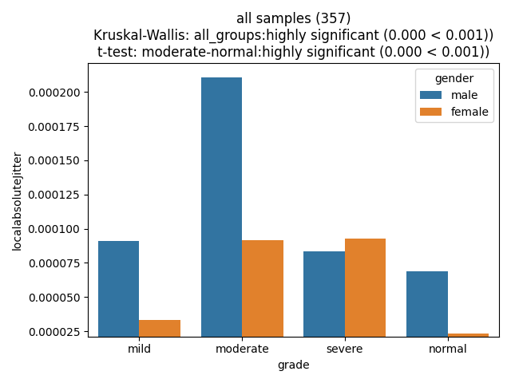

From the bar plot, the mean pattern is:

| Grade | Male | Female |
|-------|------|--------|
| moderate | ~0.00021 (highest) | ~0.000095 |
| severe | ~0.000085 | ~0.000095 |
| mild | ~0.000090 | ~0.000032 |
| normal | ~0.000070 | ~0.000015 |

**Interpretation:** Moderate-grade dysphonia is the category with the most elevated cycle-to-cycle pitch irregularity, substantially above all other grades for male speakers. This is clinically consistent: moderate dysphonia often involves significant mucus, polyps, or muscle tension disorders that disrupt vocal fold vibration without reaching the extreme aperiodicity of severe pathology. Normal-grade voices show the lowest jitter, as expected. Female speakers show less gender-within-grade variation, but moderate and severe remain elevated compared to normal.

The moderate–normal separation is the most significant pairwise contrast (p < 0.001), with additional separation between mild–moderate (p = 0.003), normal–severe (p = 0.005), and mild–severe (p = 0.037).

---

#### `meanF0Hz` — KW p < 0.001

*Praat mean fundamental frequency (Hz) over the sustained utterance.*

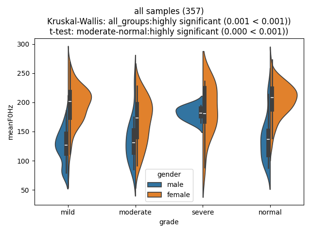

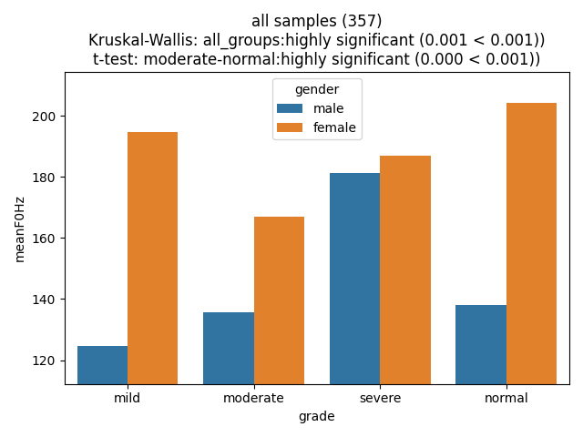

From the bar plot, mean F0 by grade and gender:

| Grade | Male | Female |
|-------|------|--------|
| severe | ~181 Hz (highest male) | ~187 Hz |
| normal | ~138 Hz | ~205 Hz (highest female) |
| moderate | ~135 Hz | ~167 Hz (lowest female) |
| mild | ~125 Hz (lowest male) | ~195 Hz |

**Interpretation:** The pattern is partly confounded by gender (females are ~50–70 Hz higher), but clear grade-related differences emerge within gender. For males, severe dysphonia shows a markedly elevated mean F0 (~181 Hz vs ~125–138 Hz for mild/normal/moderate), suggesting that severe aperiodicity or increased vocal fold stiffness pushes the fundamental frequency up. For females, moderate grade has the lowest mean F0 (~167 Hz), well below normal (~205 Hz), consistent with increased laryngeal mass or mucus loading reducing the vibration rate.

The key statistical finding is the moderate–normal separation (p < 0.001), with additional mild–normal (p = 0.013) and moderate–severe (p = 0.013) contrasts. The violin plots confirm the moderate group is most tightly concentrated at a lower register, especially in males.

---

### Marginally significant features (p < 0.1)

#### `f2_mean` — KW p = 0.093; pairwise: mild–severe p = 0.003, normal–severe p = 0.011

*Praat mean second formant frequency (Hz), measured at glottal pulse times over the sustained utterance.*

`f2_mean` is the second-highest importance feature (3.213) despite only reaching marginal overall significance, suggesting it carries ordinal information across the full grade spectrum that the global Kruskal-Wallis test partially misses. The means differ clearly between groups (bar plot recommended alongside violin):

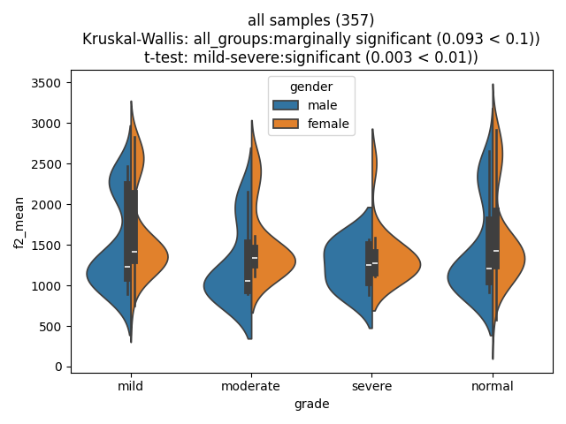

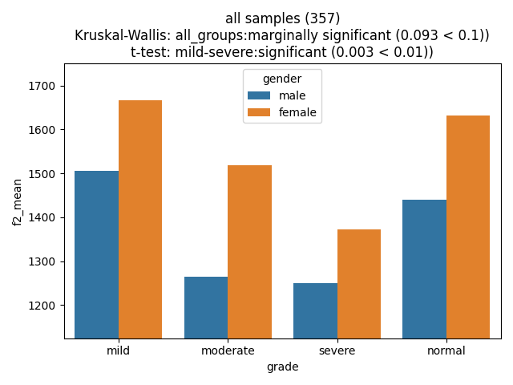

From the bar plot:

| Grade | Male | Female |
|-------|------|--------|
| mild | ~1510 Hz | ~1665 Hz |
| normal | ~1450 Hz | ~1635 Hz |
| moderate | ~1265 Hz | ~1520 Hz |
| severe | ~1250 Hz | ~1375 Hz |

**Interpretation:** F2 decreases consistently with dysphonia severity. Mild and normal speakers maintain higher F2 (~1450–1665 Hz), while moderate and severe speakers show a reduction of roughly 200–300 Hz in F2 relative to healthy voices. F2 primarily reflects tongue body advancement (front vs. back position). Lower F2 in dysphonic speakers may reflect a more retracted or tense tongue position during sustained phonation, or changes in vocal tract shape driven by increased laryngeal tension propagating to the supralaryngeal tract. The mild–severe (p = 0.003) and normal–severe (p = 0.011) contrasts are statistically robust.

---

### Pairwise-only significant features

#### `f2_median` — KW p = 0.130 (ns); pairwise: mild–severe p = 0.003, normal–severe p = 0.009

*Praat median F2 over the sustained utterance. Robust complement to f2_mean, less sensitive to outlier pulses.*

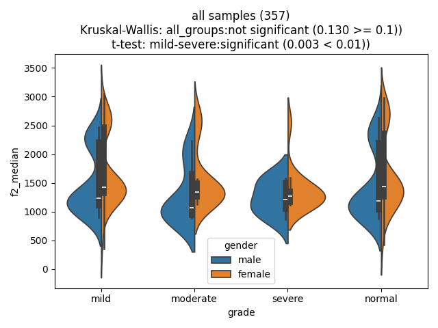

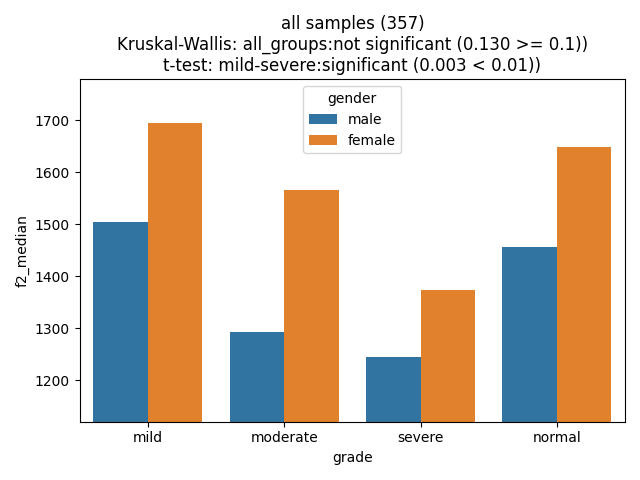

The bar plot shows essentially the same grade-ordered reduction as `f2_mean` (mild > normal > moderate > severe), confirming this is a genuine effect rather than an outlier artefact. The median is slightly lower than the mean for mild speakers, consistent with positive skew in the F2 distribution. The pairwise significance matches `f2_mean` with comparable p-values, providing convergent validity for the F2 reduction in severe dysphonia.

---

## Non-Significant High-Importance Features

The following features rank in the top 10 by permutation importance but do not reach statistical significance in any pairwise comparison. Their importance in the classifier likely reflects weak, non-monotonic, or gender-confounded ordinal trends that the ensemble models exploit without reaching group-level statistical thresholds.

#### `f3_mean` — KW p = 0.474 (rank 3, importance 2.364)

F3 (third formant, Hz) shows mild grade-related variation (male mild/normal ~2730 Hz vs. moderate/severe ~2610 Hz), but female speakers show no clear ordering. The male trend (moderate/severe lower F3) parallels the F2 finding but does not reach significance, likely because the female pattern obscures the overall effect.

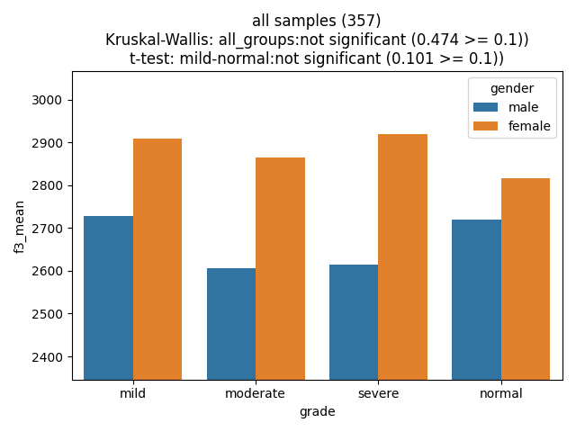

#### `f1_mean` — KW p = 0.957 (rank 4, importance 1.687)

F1 (first formant, Hz) shows no consistent grade ordering. Severe males have elevated F1 (~620 Hz) while moderate males are lowest (~515 Hz), with mild and normal in between. The female pattern shows moderate highest (~640 Hz). The contradictory directions across genders explain the high importance (informative within-gender) but poor overall significance.

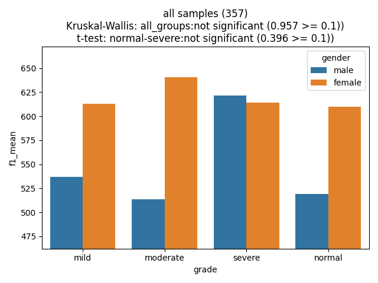

#### `mff` — KW p = 0.432 (rank 5, importance 1.601)

MFF (geometric mean of F1–F4, a vocal tract length proxy) shows moderate males as lowest (~1545 Hz) against mild/normal/severe males (~1610–1635 Hz), consistent with the F2 and F1 patterns above. Female differences are small (~1750–1815 Hz across grades). The composite does not aggregate to significance, likely due to the mixed single-formant patterns.

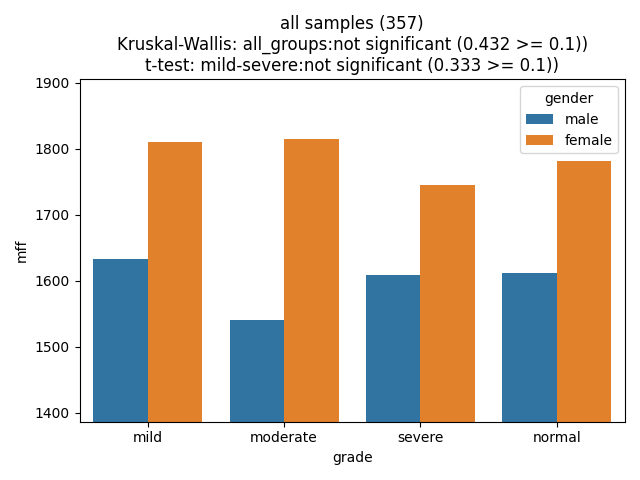

---

## Key Observations

- **Jitter is the dominant dysphonia marker**: `localabsoluteJitter` is the top-ranked feature by importance (3.406) and highly significant (p < 0.001). Moderate-grade dysphonia shows the greatest cycle-to-cycle irregularity, particularly in male speakers, making absolute jitter the strongest single acoustic indicator of voice quality degradation in this Praat-based feature set.

- **F2 tracks dysphonia severity**: Both `f2_mean` and `f2_median` show a consistent mild > normal > moderate > severe ordering. This lowering of the second formant in more severe dysphonia may reflect secondary articulatory adjustments (retracted tongue, altered vocal tract shape) accompanying laryngeal pathology.

- **Mean F0 captures a non-linear grade effect**: Moderate speakers have the lowest mean F0 (especially females and males combined), while severe speakers show elevated male F0. The moderate–normal contrast is the clearest acoustic boundary, suggesting that moderate dysphonia involves mass-loading effects (lowering F0) whereas severe dysphonia can push F0 upward through increased stiffness or aperiodic excitation.

- **Age is a major confound**: Normal and mild speakers are substantially younger (median ~20 years) than moderate and severe speakers (median ~60–70 years). Acoustic differences partly reflect normal age-related vocal changes rather than purely pathology-driven effects. The formant lowering in moderate/severe groups is consistent with age-related vocal tract changes as well as pathological processes.

- **Gender is balanced**: Chi2 p = 0.892; gender does not confound grade category membership, though gender differences within each grade (particularly for F0 and formants) are large and visible in all bar plots.

- **Formant-based features dominate importance**: Six of the top 10 features are formant frequencies or their composites (f1–f4 in Praat, mff, F2frequency_sma3nz_amean). Despite not all reaching individual statistical significance, their collective importance suggests that sustained-utterance vocal tract shape is a meaningful correlate of dysphonia grade — beyond jitter alone.
